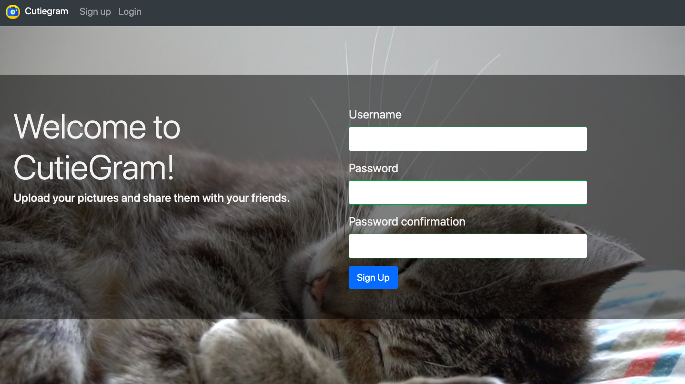

# Cutiegram 📷


## About
Instagram clone built with React and Ruby on Rails.

Key features:

A user can
* post photos/images and write captions
* edit/delete posts
* follow other users and their posts 
* leave comments on posts

* Hash tags are generated by Googole Vision AI

## Running locally
Make sure you have Ruby and Bundler installed.
```
bundle install
rails db:create
rails db:migrate
rails s
```

The project should now be running on [localhost:3000](http://localhost:3000/).

## Technologies and stack

* Ruby on Rails
* Postgresql
* Bootstrap
* Image upload: Paperclip
* Image recognition: Cloud Vision API

